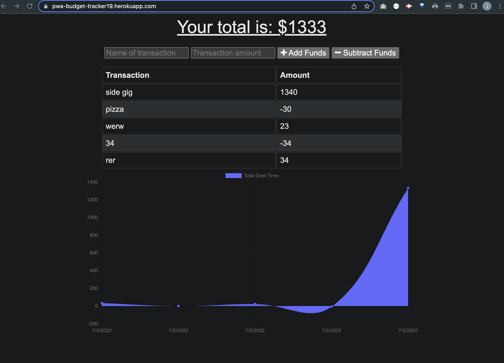

# pwa-budget-tracker

## Description

The purpose of this project to create a budgeting app that can be used online or offline. When it is offline it will save the data localy and then upload once reconnected to the internet.

## Table of Contents

- [Installation](#installation)
- [Usage](#usage)
- [Function](#function)
- [License](#license)

## Installation

You can install this by opening up the page on GitHub and cloning it to your computer using bash or terminal. Once cloned it can be opened up on VS Code.

Please see video link for a walk through on how to clone it.

[Clone to your computer](https://drive.google.com/file/d/15ogCY3Q-JLWhteoSiIoXLkhtK4Z0-mfz/view?usp=sharing "Click Me!")
  

Once cloned you can put the following commands in:
* `npm init -y`
* `npm i ` (This should download all of the dependencies)

## Usage

After you have cloned the repo to your computer and downloaded its dependencies you can run `node server` in the terminal. Then you will then be able to look at POST or GET routes on Insomnia. 

## License

---

## Tests

To test this application run by running `node server` in bash and then opening it up in Insomnia.

## Contact Me

Github: jamesfillerup
james@fillerupdev.com

